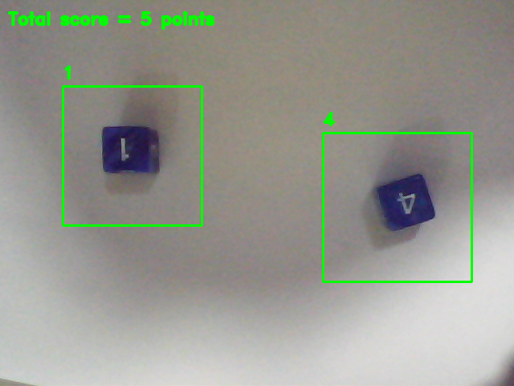

# Dice Scores Recognition in image/video

Image reecognition is a hot topic with multiple applications. In this final project I used modern teqnniques to extract the number resulted from a dice throw in an image or a video.

To conduct this project I conducted the following steps:

- Build the train dataset using my camera to obtain multiple images.

- Segment images to extract the region of the dices.

- Used Convolutional Neural Networks (CNN), identified the dice type and computed the number.

- Adapted the code to work with images or live video using a webcam.

## Dataset creation

In order to create a dataset to train a CNN, I recorded videos of each number in each dice in different angles and different lights. After that I extracted the video frames, cropped them and save into image files. Some of these images were sent to the corresponding train folder and other to the test one (~20% test).

## Image segmentation

Using these fotograms, I trained a Haar Cascade Classifier in order to be able to recognice the dices, following [this video tutorial](https://www.youtube.com/watch?v=v_cwOq06g9E) by [OMNES](https://github.com/GabySol/OmesTutorials2020). I recorded some background frames as well to provide to the Cascade Classifier positive and negative images. This provided a good detection of the dices as seen in the picture

With these image segmentation thecnique, I conducted one last preporoccesing to the image dataset. I selected better the region of the dice to extract more centered and focused images of the dices before training the CNN.

## CNN modeling

Words

## Score recognition in images and video

Words

## Final thougts

Words

